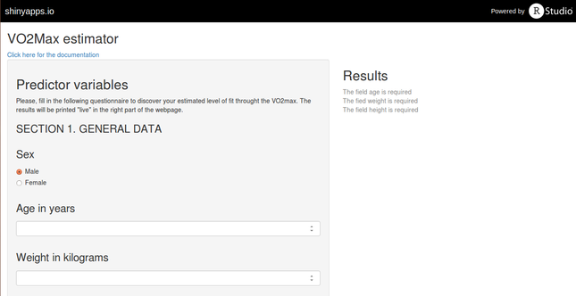

## What is the VO2Max estimator

The VO2Max estimator is an app developed with Shiny aimed to measure the level of a person's cardiorespiratory fitness (CRT) using a non exercise model. The CRT is a strong 
predictor of many risk factors such as overweight, high blood pressure and mortality.

--- .class #id 

## How it works
The VO2Max estimator implements the non exercize model proposed by George, Stone, and Burkett (1997). It's estimation is made starting from the measurement of sex, body mass index, and a self-report about physical activity.

The application is available at the url: https://gianlucamerlo.shinyapps.io/vo2max

---

## Example

For example, the VO2Max estimate for 

* a physically inactive __61__ years old __male__ 
* who weights __57__ kg
* and whose height is __1.1__ 

will be: __15.33__.

---
##  References

* George, J. D., Stone, W. J., & Burkett, L. N. (1997). *Non-exercise VO2max estimation for physically active college students*. Medicine and science in sports and exercise, 29(3), 415-423.
* Heywood, V. (1998). *The physical fitness specialist certification manual*. Dallas (TX): The Cooper Institute of Aerobics Research.
